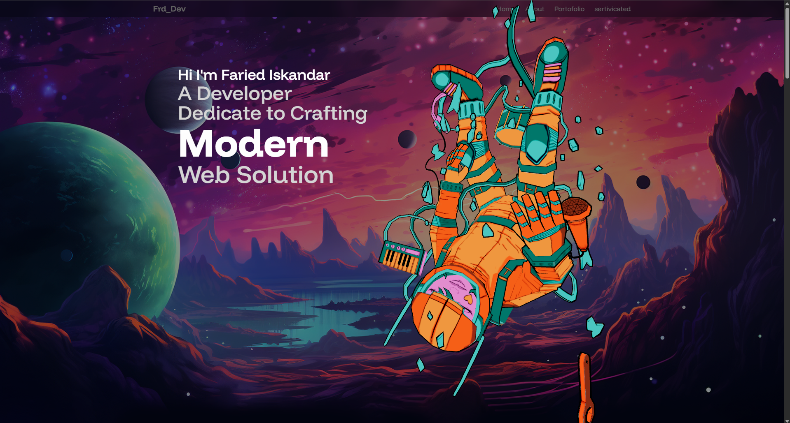

# My Personal Portfolio



## About The Project

This is my personal portfolio website, built to showcase my skills, projects, and professional experience. The website is developed using modern web technologies to create a dynamic and interactive user experience.

**Built With:**
* [React](https.reactjs.org/)
* [Vite](https://vitejs.dev/)
* [Tailwind CSS](https://tailwindcss.com/)
* [Three.js](https://threejs.org/) for 3D graphics
* [Framer Motion](https://www.framer.com/motion/) for animations

## Getting Started

To get a local copy up and running, follow these simple steps.

### Prerequisites

You need to have Node.js and npm installed on your machine.
* [Node.js](https://nodejs.org/)
* [npm](https://www.npmjs.com/get-npm)

### Installation

1. Clone the repo
   ```sh
   git clone https://github.com/frdiskandr/portofolio
   ```
2. Navigate to the project directory
   ```sh
   cd portofolio
   ```
3. Install NPM packages
   ```sh
   npm install
   ```
4. Run the development server
   ```sh
   npm run dev
   ```
5. Open your browser and go to `http://localhost:5173`

## Folder Structure

Here is the basic structure of the project:

```
/
├── public/               # Static assets (images, 3D models)
├── src/                  # Source code
│   ├── assets/           # Assets processed by Vite
│   ├── components/       # Reusable React components
│   ├── constants/        # Data for projects, experiences, etc.
│   ├── selections/       # Main sections of the website (Hero, About, etc.)
│   ├── App.jsx           # Main application component
│   └── main.jsx          # React entry point
├── .gitignore
├── Dockerfile
├── docker-compose.yml
├── index.html
├── package.json
└── vite.config.js
```

## License

Distributed under the MIT License. See `LICENSE` for more information.

---
